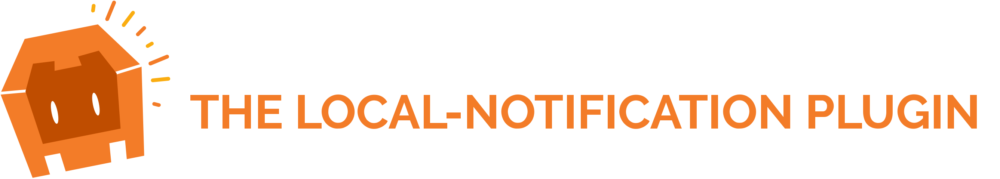
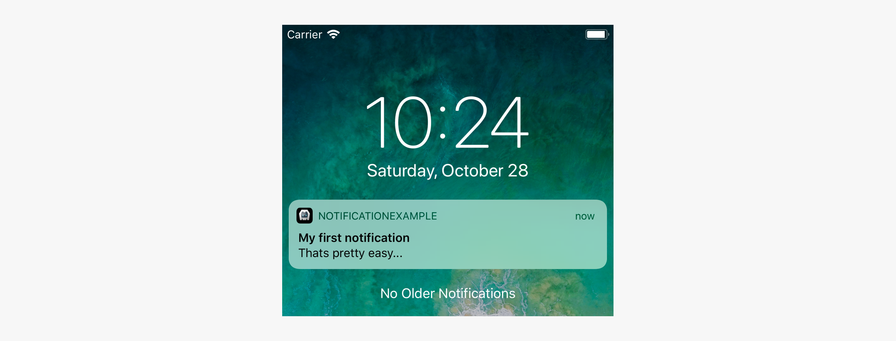
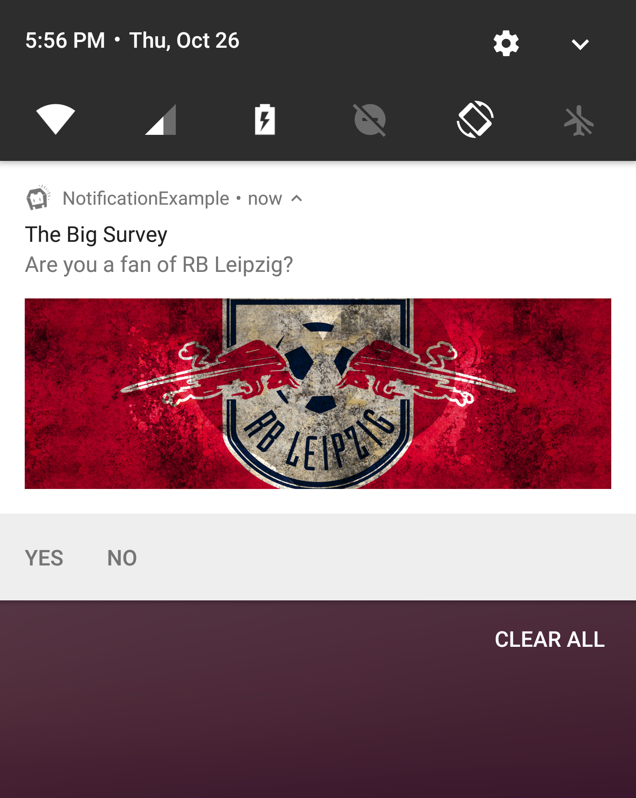
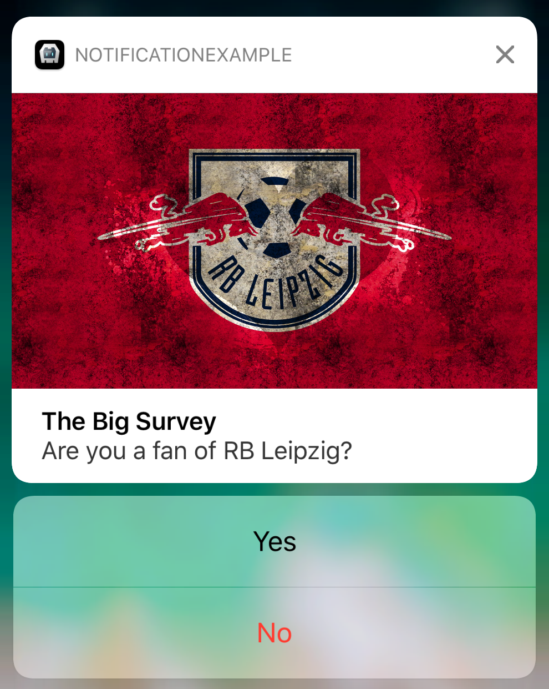
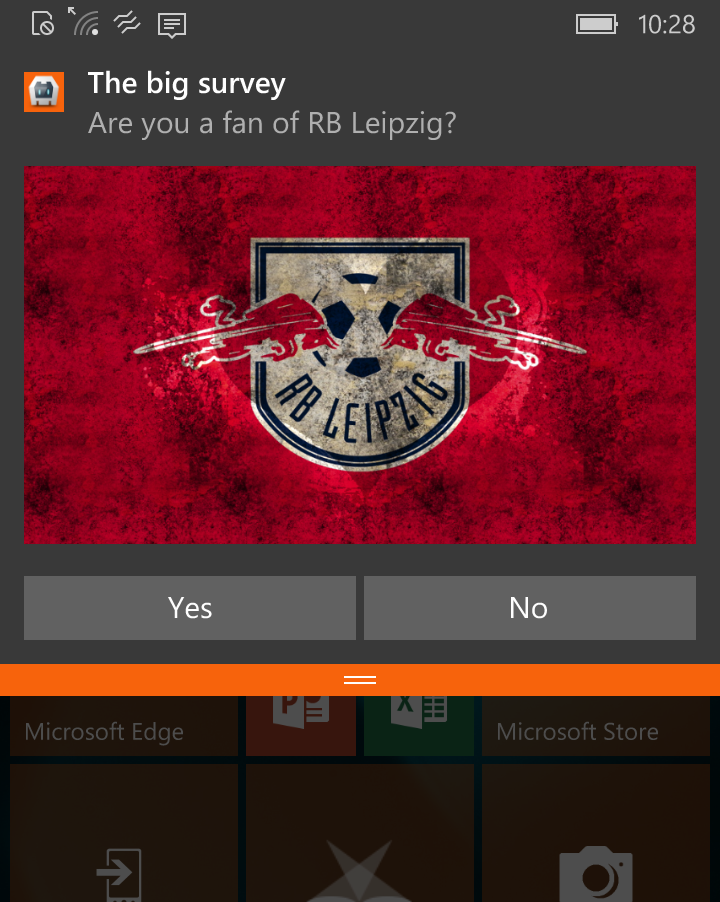
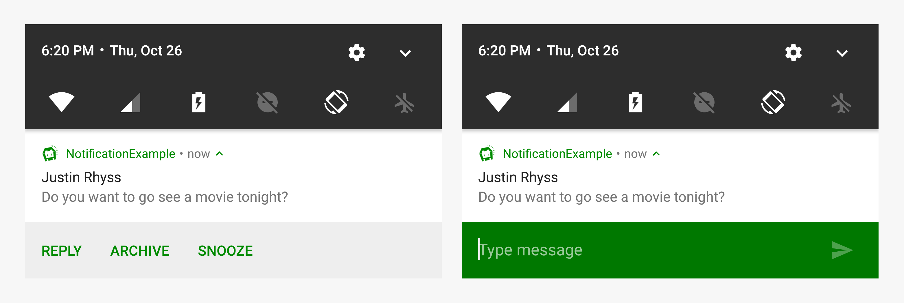
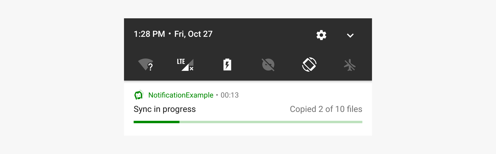
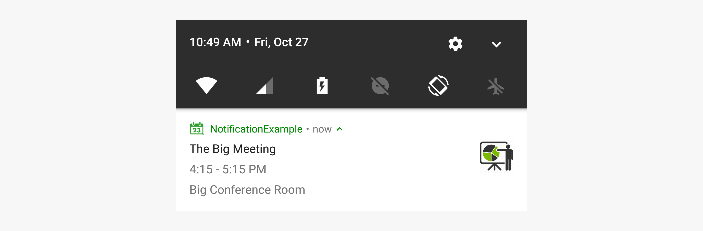
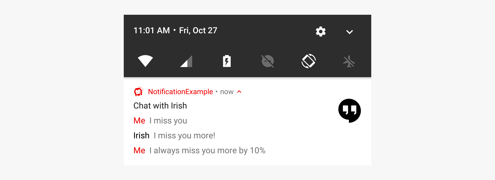
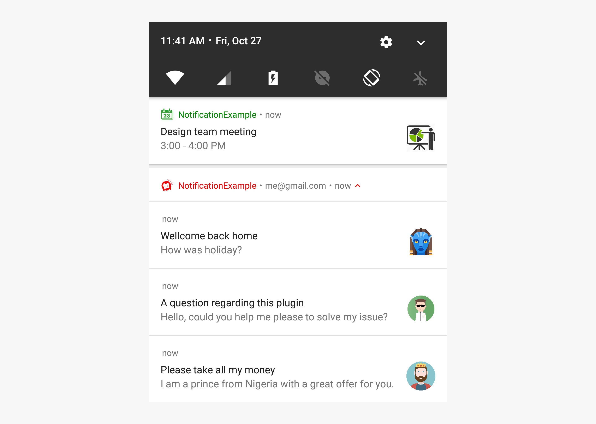

<p align="left"><b><a href="https://github.com/katzer/cordova-plugin-local-notifications/tree/example-x">SAMPLE APP</a> :point_right:</b></p>

<br>

<p align="center">
    
</p>

<p align="center">
    <a href="https://www.npmjs.com/package/cordova-plugin-local-notification">
        
    </a>
    <a href="https://www.paypal.com/cgi-bin/webscr?cmd=_s-xclick&hosted_button_id=L3HKQCD9UA35A "Donate once-off to this project using Paypal"">
        
    </a>
    <a href="https://opensource.org/licenses/Apache-2.0">
        
    </a>
</p>

<br>

> A notification is a message you display to the user outside of your app's normal UI. When you tell the system to issue a notification, it first appears as an icon in the notification area. To see the details of the notification, the user opens the notification drawer. Both the notification area and the notification drawer are system-controlled areas that the user can view at any time.

<br>

</img>
</img>

### Notification components

- Header area
- Content area
- Action area

### How notifications may be noticed

- Showing a status bar icon
- Appearing on the lock screen
- Playing a sound or vibrating
- Peeking onto the current screen
- Blinking the device's LED

### Supported platforms

- Android 4.4+
- iOS 10+
- Windows 10

<br>
<br>

## Important Notice

Please make sure that you always read the tagged README for the version you're using. 

See the _0.8_ branch if you cannot upgrade. Further development for `v0.9-beta` will happen here. The `0.9-dev` and `ios10` branches are obsolate and will be removed soon.

__Known issues__

- Support for Android Orio is limited yet.
- v0.9 and v0.8 aren't compatible with each other (Wont fix)
- __Not compatible yet with Ionic__. Their wrapper is not part of this plugin. In future I will contribute to them to fix such issues in time. But for the moment I am busy enough with the plugin itself.

Please report bugs or missing features!


## Basics

The plugin creates the object `cordova.plugins.notification.local` and is accessible after *deviceready* has been fired.

```js
cordova.plugins.notification.local.schedule({
    title: 'My first notification',
    text: 'Thats pretty easy...',
    foreground: true
});
```

<p align="center">
    
</p>

The plugin allows to schedule multiple notifications at once.

```js
cordova.plugins.notification.local.schedule([
    { id: 1, title: 'My first notification' },
    { id: 2, title: 'My first notification' }
]);
```

## Properties

A notification does have a set of configurable properties. Not all of them are supported across all platforms.

| Property      | Property      | Property      | Property      | Property      | Property      | Property      | Property      |
| :------------ | :------------ | :------------ | :------------ | :------------ | :------------ | :------------ | :------------ |
| id            | data          | actionGroupId | summary       | led           | showWhen      | channel       | actions       |
| text          | icon          | attachments   | smallIcon     | color         | defaults      | launch        | groupSummary  |
| title         | silent        | progressBar   | sticky        | vibrate       | priority      | mediaSession  | foreground    |
| sound         | trigger       | group         | autoClear     | lockscreen    | number        | badge         | wakeup        |

For their default values see:

```js
cordova.plugins.notification.local.getDefaults();
```

To change some default values:

```js
cordova.plugins.notification.local.setDefaults({
    led: { color: '#FF00FF', on: 500, off: 500 },
    vibrate: false
});
```

## Actions

The plugin knows two types of actions: _button_ and _input_.

```js
cordova.plugins.notification.local.schedule({
    title: 'The big survey',
    text: 'Are you a fan of RB Leipzig?',
    attachments: ['file://img/rb-leipzig.jpg'],
    actions: [
        { id: 'yes', title: 'Yes' },
        { id: 'no',  title: 'No' }
    ]
});
```

<p align="center">
    
    &nbsp;&nbsp;&nbsp;&nbsp;
    
    &nbsp;&nbsp;&nbsp;&nbsp;
    
</p>

### Input

```js
cordova.plugins.notification.local.schedule({
    title: 'Justin Rhyss',
    text: 'Do you want to go see a movie tonight?',
    actions: [{
        id: 'reply',
        type: 'input',
        title: 'Reply',
        emptyText: 'Type message',
    }, ... ]
});
```

<p align="center">
    
</p>

It is recommended to pre-define action groups rather then specifying them with each new notification of the same type.


```js
cordova.plugins.notification.local.addActionGroup('yes-no', [
    { id: 'yes', title: 'Yes' },
    { id: 'no',  title: 'No'  }
]);
```

Once you have defined an action group, you can reference it when scheduling notifications: 

```js
cordova.plugins.notification.local.schedule({
    title: 'Justin Rhyss',
    text: 'Do you want to go see a movie tonight?',
    actionGroupId: 'yes-no'
});
```

### Properties

Actions do have a set of configurable properties. Not all of them are supported across all platforms.

| Property     | Type         | Android | iOS | Windows |
| :----------- | :----------- | :------ | :-- | :------ |
| id           | button+input | x       | x   | x       |
| title        | button+input | x       | x   | x       |
| launch       | button+input | x       | x   | x       |
| ui           | button+input |         | x   |         |
| needsAuth    | button+input |         | x   |         |
| icon         | button+input | x       |     |         |
| emptyText    | input        | x       | x   | x       |
| submitTitle  | input        |         | x   |         |
| editable     | input        | x       |     |         |
| choices      | input        | x       |     |         |
| defaultValue | input        |         |     | x       |


## Triggers

Notifications may trigger immediately or depend on calendar or location.

To trigger at a fix date:

```js
cordova.plugins.notification.local.schedule({
    title: 'Design team meeting',
    text: '3:00 - 4:00 PM',
    trigger: { at: new Date(2017, 10, 27, 15) }
});
```

Or relative from now:

```js
cordova.plugins.notification.local.schedule({
    title: 'Design team meeting',
    trigger: { in: 1, unit: 'hour' }
});
```

### Repeating

Repeat relative from now:

```js
cordova.plugins.notification.local.schedule({
    title: 'Design team meeting',
    trigger: { every: 'day', count: 5 }
});
```

Or trigger every time the date matches:

```js
cordova.plugins.notification.local.schedule({
    title: 'Happy Birthday!!!',
    trigger: { every: { month: 10, day: 27, hour: 9, minute: 0 } }
});
```

### Location based

To trigger when the user enters a region:

```js
cordova.plugins.notification.local.schedule({
    title: 'Welcome to our office',
    trigger: {
        type: 'location',
        center: [x, y],
        radius: 15,
        notifyOnEntry: true
    }
});
```

### Properties

The properties depend on the trigger type. Not all of them are supported across all platforms.

| Type         | Property      | Type    | Value            | Android | iOS | Windows |
| :----------- | :------------ | :------ | :--------------- | :------ | :-- | :------ |
| Fix          | 
|              | at            | Date    |                  | x       | x   | x       |
| Timespan     |
|              | in            | Int     |                  | x       | x   | x       |
|              | unit          | String  | `second`         | x       | x   | x       |
|              | unit          | String  | `minute`         | x       | x   | x       |
|              | unit          | String  | `hour`           | x       | x   | x       |
|              | unit          | String  | `day`            | x       | x   | x       |
|              | unit          | String  | `week`           | x       | x   | x       |
|              | unit          | String  | `month`          | x       | x   | x       |
|              | unit          | String  | `quarter`        | x       | x   | x       |
|              | unit          | String  | `year`           | x       | x   | x       |
| Repeat       |
|              | count         | Int     |                  | x       |     | x       |
|              | every         | String  | `minute`         | x       | x   | x       |
|              | every         | String  | `hour`           | x       | x   | x       |
|              | every         | String  | `day`            | x       | x   | x       |
|              | every         | String  | `week`           | x       | x   | x       |
|              | every         | String  | `month`          | x       | x   | x       |
|              | every         | String  | `quarter`        | x       |     | x       |
|              | every         | String  | `year`           | x       | x   | x       |
|              | before        | Date    |                  | x       |     | x       |
|              | firstAt       | Date    |                  | x       | x   | x       |
| Match        |
|              | count         | Int     |                  | x       |     | x       |
|              | every         | Object  | `minute`         | x       | x   | x       |
|              | every         | Object  | `hour`           | x       | x   | x       |
|              | every         | Object  | `day`            | x       | x   | x       |
|              | every         | Object  | `weekday`        | x       | x   | x       |
|              | every         | Object  | `weekdayOrdinal` |         | x   |
|              | every         | Object  | `week`           |         | x   |
|              | every         | Object  | `weekOfMonth`    | x       | x   | x       |
|              | every         | Object  | `month`          | x       | x   | x       |
|              | every         | Object  | `quarter`        |         | x   |
|              | every         | Object  | `year`           | x       | x   | x       |
|              | before        | Date    |                  | x       |     | x       |
|              | after         | Date    |                  | x       | x   | x       |
| Location     |
|              | center        | Array   | `[lat, long]`    |         | x   |
|              | radius        | Int     |                  |         | x   |
|              | notifyOnEntry | Boolean |                  |         | x   |
|              | notifyOnExit  | Boolean |                  |         | x   |
|              | single        | Boolean |                  |         | x   |


## Progress

Notifications can include an animated progress indicator that shows users the status of an ongoing operation.

```js
cordova.plugins.notification.local.schedule({
    title: 'Sync in progress',
    text: 'Copied 2 of 10 files',
    progressBar: { value: 20 }
});
```

<p align="center">
    
</p>


## Patterns

Split the text by line breaks if the message comes from a single person and just too long to show in a single line.

```js
cordova.plugins.notification.local.schedule({
    title: 'The Big Meeting',
    text: '4:15 - 5:15 PM\nBig Conference Room',
    smallIcon: 'res://calendar',
    icon: 'https://encrypted-tbn0.gstatic.com/images?q=tbn:ANd9GcTzfXKe6Yfjr6rCtR6cMPJB8CqMAYWECDtDqH-eMnerHHuXv9egrw'
});
```

<p align="center">
    
</p>

### Summarizing

Instead of displaying multiple notifications, you can create one notification that summarizes them all.

```js
cordova.plugins.notification.local.schedule({
    id: 15,
    title: 'Chat with Irish',
    icon: 'http://climberindonesia.com/assets/icon/ionicons-2.0.1/png/512/android-chat.png',
    text: [
        { message: 'I miss you' },
        { person: 'Irish', message: 'I miss you more!' },
        { message: 'I always miss you more by 10%' }
    ]
});
```

<p align="center">
    
</p>

To add a new message to the existing chat:

```js
cordova.plugins.notification.local.update({
    id: 15,
    text: [{ person: 'Irish', message: 'Bye bye' }]
});
```

### Grouping

Your app can present multiple notifications as a single group:

- A parent notification displays a summary of its child notifications.
- The child notifications are presented without duplicate header information.

```js
cordova.plugins.notification.local.schedule([
    { id: 0, title: 'Design team meeting', ... },
    { id: 1, summary: 'me@gmail.com', group: 'email', groupSummary: true },
    { id: 2, title: 'Please take all my money', ... group: 'email' },
    { id: 3, title: 'A question regarding this plugin', ... group: 'email' },
    { id: 4, title: 'Wellcome back home', ... group: 'email' }
]);
```

<p align="center">
    
</p>


## Permissions

Each platform may require the user to grant permissions first before the app is allowed to schedule notifications.

```js
cordova.plugins.notification.local.hasPermission(function (granted) { ... });
```

If requesting via plug-in, a system dialog does pop up for the first time. Later its only possible to tweak the settings through the system settings.

```js
cordova.plugins.notification.local.requestPermission(function (granted) { ... });
```

<p align="center">
    
</p>

Checking the permissions is done automatically, however it's possible to skip that.

```js
cordova.plugins.notification.local.schedule(toast, callback, scope, { skipPermission: true });
```


## Events

The following events are supported: `add`, `trigger`, `click`, `clear`, `cancel`, `update`, `clearall` and `cancelall`.

```js
cordova.plugins.notification.local.on(event, callback, scope);
```

To unsubscribe from events:

```js
cordova.plugins.notification.local.un(event, callback, scope);
```

__Note:__ You have to provide the exact same callback to `cordova.plugins.notification.local.un` as you provided to `cordova.plugins.notification.local.on` to make unsubscribing work.  
Hence you should define your callback as a separate function, not inline. If you want to use `this` inside of your callback, you also have to provide `this` as `scope` to `cordova.plugins.notification.local.on`.

### Custom

The plugin also fires events specified by actions.

```js
cordova.plugins.notification.local.schedule({
    title: 'Do you want to go see a movie tonight?',
    actions: [{ id: 'yes', title: 'Yes' }]
});
```

The name of the event is the id of the action.

```js
cordova.plugins.notification.local.on('yes', function (notification, eopts) { ... });
```

### Fire manually

Not an official interface, however its possible to manually fire events.

```js
cordova.plugins.notification.local.core.fireEvent(event, args);
```


## Launch Details

Check the `launchDetails` to find out if the app was launched by clicking on a notification.

```js
document.addEventListener('deviceready', function () {
    console.log(cordova.plugins.notification.local.launchDetails);
}, false);
```


## Methods

All methods work asynchron and accept callback methods.
See the sample app for how to use them.

| Method   | Method            | Method          | Method         | Method      |
| :------- | :---------------- | :-------------- | :------------- | :---------- |
| schedule | cancelAll         | isTriggered     | get            | getDefaults |
| update   | hasPermission     | getType         | getAll         | setDefaults |
| clear    | requestPermission | getIds          | getScheduled   | on          |
| clearAll | isPresent         | getScheduledIds | getTriggered   | un          |
| cancel   | isScheduled       | getTriggeredIds | addActionGroup |


## Installation

The plugin can be installed via [Cordova-CLI][CLI] and is publicly available on [NPM][npm].

Execute from the projects root folder:

    $ cordova plugin add cordova-plugin-local-notification

Or install a specific version:

    $ cordova plugin add cordova-plugin-local-notification@VERSION

Or install the latest head version:

    $ cordova plugin add https://github.com/katzer/cordova-plugin-local-notifications.git

Or install from local source:

    $ cordova plugin add <path> --nofetch --nosave --link


## Contributing

1. Fork it
2. Create your feature branch (`git checkout -b my-new-feature`)
3. Commit your changes (`git commit -am 'Add some feature'`)
4. Push to the branch (`git push origin my-new-feature`)
5. Create new Pull Request


## License

This software is released under the [Apache 2.0 License][apache2_license].

Made with :yum: from Leipzig

© 2013 [appPlant GmbH][appplant]


[ticket_template]: https://github.com/katzer/cordova-plugin-local-notifications/issues/1188
[cordova]: https://cordova.apache.org
[CLI]: http://cordova.apache.org/docs/en/edge/guide_cli_index.md.html#The%20Command-line%20Interface
[npm]: https://www.npmjs.com/package/cordova-plugin-local-notification
[apache2_license]: http://opensource.org/licenses/Apache-2.0
[appplant]: http://appplant.de
