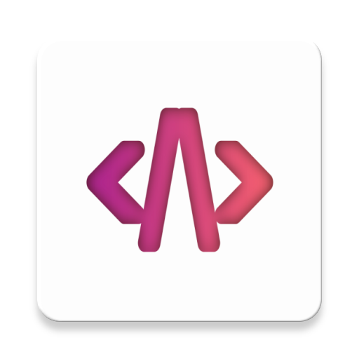

# Acode editor (Code editor for android)



Acode is a hybrid app using Apache Cordova. This app is available on the play store. Check it out from [here](https://acode.foxdebug.com).

[](https://f-droid.org/packages/com.foxdebug.acode/)
[](https://play.google.com/store/apps/details?id=com.foxdebug.acodefree)

## Project structure

- `src` (directory) contains all raw codes
- `www` (directory) contains public documents, built javascript and CSS files, language files, and HTML files
- `utils` (directory) contains the CLI tool to manipulate or add strings to all languages easily

## Multi-language support

To add new language, create a new file with language code for android (eg. en-us for english) in [`www/lang/`](https://github.com/deadlyjack/code-editor/tree/master/www/lang) directory. After adding new laguage also add it to [`src/constants.js -> langList`](https://github.com/deadlyjack/code-editor/blob/master/src/lib/constants.js#L89).

Here are few utility tools to add, remove or search a string in all added languages.

```bash
yarn lang add
yarn lang remove
yarn lang search
yarn lang update
```

## How to build

To build the APK you need Nodejs, NPM, and Apache Cordova installed on your device. Use Cordova CLI to build the application.

Run `npm install` to install all dependencies before building the APK.

`yarn build <platform (android)> <free|paid> <p|prod|d|dev>`

## Develop plugin for Acode

Please read this [documentation](https://acode.foxdebug.com/docs/plugin) on official website.

## Special thanks to

- [Ace editor](https://ace.c9.io/)
- [Autosize](http://www.jacklmoore.com/autosize/)
- [Apache cordova](https://cordova.apache.org/)
- [babeljs.io](https://babeljs.io/)
- [Cordova plugin intent](https://github.com/napolitano/cordova-plugin-intent)
- [Esprima](https://esprima.org/)
- [Mustache](https://github.com/janl/mustache.js)
- [Marked](https://marked.js.org/)
- [Mime types](https://www.npmjs.com/package/mime-types)
- [Webpack](https://webpack.js.org/)
- [Vanilla picker](https://vanilla-picker.js.org/)
